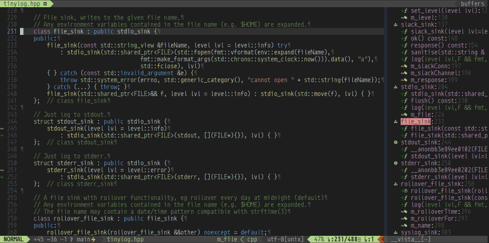

# vim-config

This is my private VIM setup that I use to develop C++, D and some R and Python on Ubuntu 20.04 LTS.

## Example keyboard shortcuts

* <F1> Toggles NerdTree on the left (i.e. file explorer).
* <F2> Gvdiffsplit (i.e. `git diff` inside vim).
* <F12> Toggles Vista on the right (i.e. LSP symbol browser).
* K Show the man page for the word under the cursor (via cppman - only for C++).
* \gb GIT blame
* \gc GIT commit
* \gd GIT diff
* \gl GIT log
* \gp GIT push
* \gs GIT status

## Colour scheme

I use _vsdark_, based on the Visual Studio dark colour scheme.

# Requirements

* neovim >= 0.5.0 (I use 0.6.0)

    sudo add-apt-repository ppa:neovim-ppa/unstable

    sudo apt update

    sudo apt install neovim

* NerdFont of your choice from https://www.nerdfonts.com/

    Some examples:

    cd ~/.fonts

    wget https://github.com/ryanoasis/nerd-fonts/releases/download/v2.1.0/Agave.zip; unzip Agave.zip; rm -f Agave.zip

    wget https://github.com/ryanoasis/nerd-fonts/releases/download/v2.1.0/CascadiaCode.zip; unzip CascadiaCode.zip; rm -f CascadiaCode.zip

    wget https://github.com/ryanoasis/nerd-fonts/releases/download/v2.1.0/DaddyTimeMono.zip; unzip DaddyTimeMono.zip; rm -f DaddyTimeMono.zip

    wget https://github.com/ryanoasis/nerd-fonts/releases/download/v2.1.0/JetBrainsMono.zip; unzip JetBrainsMono.zip; rm -f JetBrainsMono.zip

    wget https://github.com/ryanoasis/nerd-fonts/releases/download/v2.1.0/Hack.zip; unzip Hack.zip; rm -f Hack.zip

    wget https://github.com/ryanoasis/nerd-fonts/releases/download/v2.1.0/SpaceMono.zip; unzip SpaceMono.zip; rm -f SpaceMono.zip

    wget https://github.com/ryanoasis/nerd-fonts/releases/download/v2.1.0/BitstreamVeraSansMono.zip; unzip BitstreamVeraSansMono.zip; rm -f BitstreamVeraSansMono.zip

    wget https://github.com/ryanoasis/nerd-fonts/releases/download/v2.1.0/Monoid.zip; unzip Monoid.zip; rm -f Monoid.zip

    fc-cache -f

# Installation

    git clone https://github.com/sinisa-susnjar/vim-config.git

    cd vim-config

    git clone https://github.com/VundleVim/Vundle.vim.git vim/bundle/Vundle.vim

    cd

    if [ -f .vimrc ]; then mv .vimrc .vimrc.bak; fi
    if [ -d .vim ]; then mv .vim .vim.bak; fi
    if [ -d .config/nvim ]; then mv .config/nvim .config/nvim.bak; fi

    ln -s $OLDPWD/vimrc ~/.vimrc
    ln -s $OLDPWD/vim ~/.vim
    ln -s $OLDPWD/nvim ~/.config/nvim

# Install Plugins for NeoVim

    :PluginInstall
    :UpdateRemotePlugins

# Install LSP servers

This setup uses clangd for C++, serve-d/dcd for D, python-lsp for Python,
REditorSupport-languageserver for R and cmake-language-server for CMake:

    sudo apt install clangd-12
    sudo update-alternatives --install /usr/bin/clangd clangd /usr/bin/clangd-12 100
    sudo update-alternatives --install /usr/bin/clang clang /usr/bin/clang-12 100
    sudo update-alternatives --install /usr/bin/clang++ clang++ /usr/bin/clang++-12 100

    git clone https://github.com/Pure-D/serve-d.git; cd serve-d; dub build -b release
    git clone https://github.com/dlang-community/DCD.git; cd DCD; dub build -b release -c client; dub build -b release -c server

    pip3 install 'python-lsp-server[all]'

    R -e 'install.packages("languageserver")'

	pip3 install cmake-language-server

# Screenshots

Everybody loves screenshots :)

